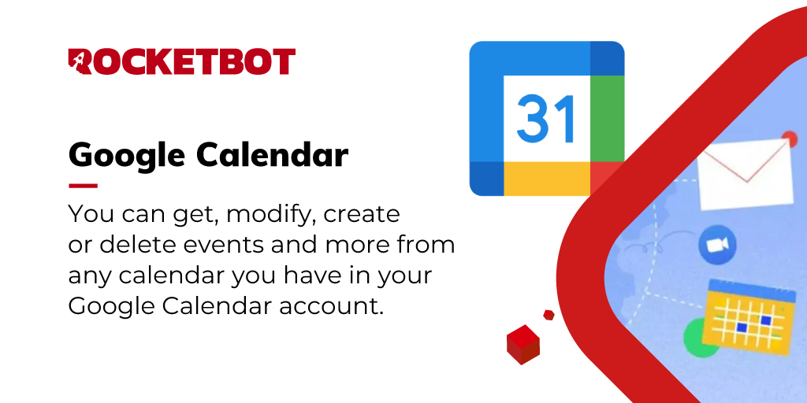

# Google Calendar
  
Pode obter, modificar, criar ou eliminar eventos e mais de qualquer calendário que tenhas na sua conta do Google Calendar  

*Read this in other languages: [English](Manual_GoogleCalendar.md), [Português](Manual_GoogleCalendar.pr.md), [Español](Manual_GoogleCalendar.es.md)*
  

## Como instalar este módulo
  
Para instalar o módulo no Rocketbot Studio, pode ser feito de duas formas:
1. Manual: __Baixe__ o arquivo .zip e descompacte-o na pasta módulos. O nome da pasta deve ser o mesmo do módulo e dentro dela devem ter os seguintes arquivos e pastas: \__init__.py, package.json, docs, example e libs. Se você tiver o aplicativo aberto, atualize seu navegador para poder usar o novo módulo.
2. Automático: Ao entrar no Rocketbot Studio na margem direita você encontrará a seção **Addons**, selecione **Install Mods**, procure o módulo desejado e aperte instalar.  

## Como usar este módulo

Antes de usar este módulo, você deve registrar seu aplicativo no Google Cloud Portal.

1. Faça login com uma conta do Google e entre no seguinte link: https://console.cloud.google.com/projectcreate?previousPage=%2Fhome%2Fdashboard
2. Preencha o formulário para criar um novo projeto e pressione "Criar".
3. No Menu de Navegação (Esquerda), entre em API e Serviços.
4. Vá para a seção superior e pressione "+ ATIVAR API E SERVIÇOS".
5. Pesquise por "Google Calendar API", selecione-o e pressione "ATIVAR".
6. Volte para o Menu de Navegação, vá para API e Serviços e depois entre em Credenciais.
7. Pressione Criar credenciais e selecione ID do cliente OAuth. Em seguida, selecione Tipo de aplicativo: Aplicativo de desktop, dê um nome a ele e pressione Criar.
8. Faça download do arquivo JSON de credenciais.
9. Por fim, volte ao Menu de Navegação, vá até a Tela de Consentimento e adicione seu usuário na seção "Testar Usuários" (mesmo que seja o mesmo que está criando o 
app).

Nota: Quando a primeira conexão for feita, um arquivo .pickle será criado na pasta raiz do Rocketbot, para se conectar ao mesmo serviço com outra conta, você deve dar um nome a cada sessão. Se as credenciais expirarem, você deverá excluir o arquivo .pickle e criar e baixar um arquivo de credenciais novo (JSON).

## Descrição do comando

### Configurar credenciais G-Suite
  
Obtém permissão para trabalhar no Google SpreadSheet com o Rocketbot
|Parâmetros|Descrição|exemplo|
| --- | --- | --- |
|Caminho de credenciais|Arquivo JSON com as credenciais de acesso ao API do Google Calentar.|C:/caminho/credenciais.json|
|Porto (Opcional)||8080|
|Session||session|

### Listar calendários
  
Listar calendários do usuário
|Parâmetros|Descrição|exemplo|
| --- | --- | --- |
|Resultado||Variável|
|Session||session|

### Listar Eventos
  
Listar eventos da agenda de um usuário
|Parâmetros|Descrição|exemplo|
| --- | --- | --- |
|ID do calendário||Calendar ID|
|Resultado||Variável|
|Session||session|

### Obter evento
  
Obtenha um evento de um calendário
|Parâmetros|Descrição|exemplo|
| --- | --- | --- |
|ID do calendário||Calendar ID|
|ID do evento||Event ID|
|Resultado||Variável|
|Session||session|

### Criar Evento
  
Crie um evento na agenda de um usuário
|Parâmetros|Descrição|exemplo|
| --- | --- | --- |
|Dados do Evento||{'summary': 'Google I/O 2015', 'location': '800 Howard St., San Francisco, CA 94103', 'description': 'A chance to hear more about Google's developer products.', 'start': {'dateTime': '2015-05-28T09:00:00-07:00', 'timeZone': 'America/Los_Angeles'}, 'end': {'dateTime': '2015-05-28T17:00:00-07:00', 'timeZone': 'America/Los_Angeles'}, 'recurrence': ['RRULE:FREQ=DAILY;COUNT=2'], 'attendees': [{'email': 'lpage@example.com'}, {'email': 'sbrin@example.com'}], 'reminders': {'useDefault': False, 'overrides': [{'method': 'email', 'minutes': 1440}, {'method': 'popup', 'minutes': 10}]}}}|
|ID do calendário||Calendar ID|
|Título ||Novo Evento|
|Localização ||800 Howard St., San Francisco, CA 94103|
|Descrição ||Evento para...|
|Data de Início ||2015-05-28T09:00:00|
|Zona Horária de Início ||America/Los_Angeles|
|Data de Fim ||2015-05-28T12:00:00|
|Zona Horária de Fim ||America/Los_Angeles|
|Frequência |Para armar a regra de frequência visite a documentação https//developers.google.com/calendar/api/v3/reference/events/insert|['RRULE:FREQ=DAILY;COUNT=2']|
|Convidados |Para mais de um convidado armar uma lista de dicionários, para apenas um convidado armar um dicionário.|[{'email': 'lpage@example.com'}, {'email': 'sbrin@example.com'}]|
|Lembramentos |Para mais de um lembramento armar uma lista de dicionários, para apenas um armar um dicionário.|[{'method': 'email', 'minutes': 1440}, {'method': 'popup', 'minutes': 10}]|
|Enviar notificações|Enviar notificações por e-mail|-|
|Resultado||Variável|
|Session||session|

### Atualizar Evento
  
Atualizar um evento na agenda de um usuário
|Parâmetros|Descrição|exemplo|
| --- | --- | --- |
|Dados para Modificar||{'attendees': [{'email': 'lpage@example.com'}, {'email': 'sbrin@example.com'}]}|
|ID do calendário||Calendar ID|
|ID do evento||Event ID|
|Enviar notificações|Enviar notificações por e-mail|-|
|Resultado||Variável|
|Session||session|

### Assistentes de atualização
  
Atualizar participantes de um evento
|Parâmetros|Descrição|exemplo|
| --- | --- | --- |
|Dados para Modificar||['lpage@example.com', 'sbrin@example.com']|
|ID do calendário||Calendar ID|
|ID do evento||Event ID|
|Enviar notificações|Enviar notificações por e-mail|-|
|Resultado||Variável|
|Session||session|

### Cancelar Evento
  
Excluir um evento da agenda de um usuário
|Parâmetros|Descrição|exemplo|
| --- | --- | --- |
|ID do evento||Event ID|
|ID do calendário||Calendar ID|
|Enviar notificações|Enviar notificações por e-mail|-|
|Resultado||Variável|
|Session||session|
